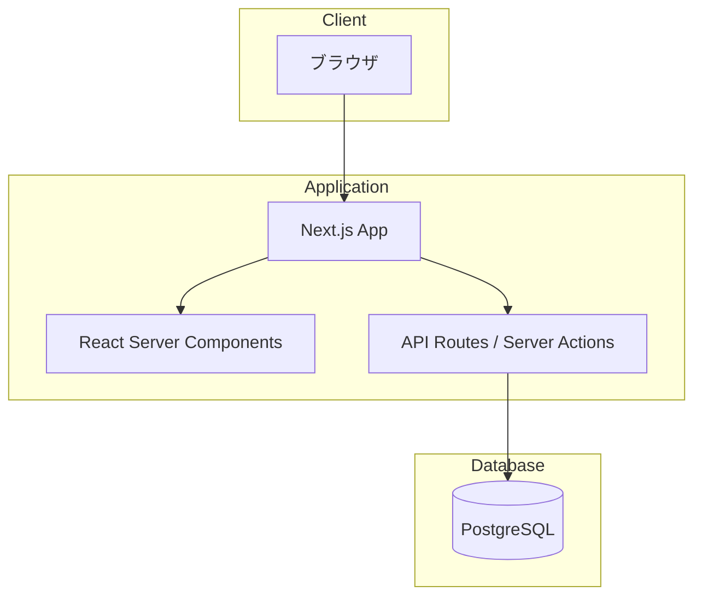

# 技術仕様書（Architecture）

## 概要

草野球チーム Albatross（Alba）の管理 Web アプリケーションの技術仕様を定義します。

---

## 技術方針

本プロジェクトでは、React および Next.js の最新機能を積極的に採用します。

### 採用する最新技術・パターン

- **React Server Components (RSC)**: サーバーサイドでのコンポーネントレンダリング
- **Server Actions**: フォーム処理やデータ変更をサーバーサイドで実行
- **Streaming / Suspense**: 段階的なコンテンツ表示による UX 向上
- **Parallel Routes / Intercepting Routes**: 高度なルーティングパターン
- **React 19 の新機能**: `use` フック、Actions、`useOptimistic` など

### 方針

- 新機能が安定版としてリリースされた場合、積極的に導入を検討する
- 実験的機能（Canary）は本番環境では使用しない
- 破壊的変更を伴うアップデートは、十分なテストを経て適用する

---

## テクノロジースタック

### フロントエンド

| カテゴリ       | 技術           | バージョン | 用途                              |
| -------------- | -------------- | ---------- | --------------------------------- |
| フレームワーク | Next.js        | 16.1.1     | フルスタック React フレームワーク |
| UI ライブラリ  | React          | 19.2.3     | ユーザーインターフェース構築      |
| スタイリング   | Tailwind CSS   | 4.1.18     | ユーティリティファースト CSS      |
| CSS プロセッサ | PostCSS        | 8.5.6      | CSS 変換・最適化                  |
| 言語           | TypeScript     | 5.9.3      | 型安全な JavaScript               |
| 日付処理       | @formkit/tempo | 1.0.0      | 日付・時刻の処理                  |

### バックエンド

| カテゴリ     | 技術               | バージョン | 用途                       |
| ------------ | ------------------ | ---------- | -------------------------- |
| ORM          | Prisma             | 7.2.0      | データベース操作           |
| データベース | PostgreSQL         | 17         | リレーショナルデータベース |
| DB アダプタ  | @prisma/adapter-pg | 7.2.0      | PostgreSQL 接続            |
| DB ドライバ  | pg                 | 8.16.3     | PostgreSQL ドライバ        |

### 開発環境

| カテゴリ         | 技術                   | バージョン | 用途                       |
| ---------------- | ---------------------- | ---------- | -------------------------- |
| ランタイム       | Node.js                | 24.11.1    | JavaScript 実行環境        |
| パッケージ管理   | pnpm                   | 10.27.0    | 高速なパッケージマネージャ |
| コンテナ         | Docker Compose         | -          | ローカル DB 環境構築       |
| リンター         | Biome                  | 2.3.10     | コード品質・フォーマット   |
| 未使用検出       | Knip                   | 5.79.0     | 未使用コード検出           |
| テスト           | Vitest                 | 4.0.16     | ユニットテスト             |
| テストライブラリ | @testing-library/react | 16.3.1     | React コンポーネントテスト |
| TypeScript 実行  | tsx                    | 4.21.0     | TypeScript 直接実行        |

---

## 開発ツールと手法

### コード品質管理

- **Biome**: リンティング・フォーマットを統合
  - インデント: スペース
  - 行幅: 80 文字
  - 相対パスインポート禁止（`@/` エイリアス使用）
- **Knip**: 未使用ファイル・エクスポートの検出
- **TypeScript**: strict モード有効

### テスト戦略

| テスト種別               | ツール                   | 対象範囲                       |
| ------------------------ | ------------------------ | ------------------------------ |
| ユニットテスト           | Vitest + Testing Library | コンポーネント・ユーティリティ |
| インテグレーションテスト | Vitest                   | API・データ層                  |
| E2E テスト               | Playwright               | ユーザーフロー全体             |

### デプロイメント

| 環境       | プラットフォーム | URL                   |
| ---------- | ---------------- | --------------------- |
| 開発       | ローカル         | http://localhost:3000 |
| プレビュー | Vercel Preview   | PR ごとに自動生成     |
| 本番       | Vercel           | <!-- 未定 -->         |

---

## 技術的制約と要件

### ブラウザサポート

レスポンシブデザインを採用し、モバイル・デスクトップ両方に対応します。

| ブラウザ          | サポートバージョン |
| ----------------- | ------------------ |
| Chrome            | 最新 バージョン    |
| Chrome (モバイル) | 最新 バージョン    |
| Safari (iOS)      | 最新 バージョン    |

### セキュリティ要件

- **認証方式**: NextAuth.js
- **認可方式**: ロールベースアクセス制御（RBAC）<!-- 詳細は要検討 -->
- **データ暗号化**: HTTPS（TLS 1.2 以上）

### アクセシビリティ

| 項目                     | 要件       |
| ------------------------ | ---------- |
| WCAG 準拠レベル          | AA（目標） |
| キーボードナビゲーション | 対応       |
| スクリーンリーダー       | 対応       |

---

## パフォーマンス要件

### レスポンスタイム

| 指標             | 目標値     |
| ---------------- | ---------- |
| 初期ページロード | 3 秒以内   |
| ページ遷移       | 1 秒以内   |
| API レスポンス   | 500ms 以内 |

### Core Web Vitals

| 指標 | 目標値     | 説明                      |
| ---- | ---------- | ------------------------- |
| LCP  | 2.5 秒以内 | Largest Contentful Paint  |
| INP  | 200ms 以内 | Interaction to Next Paint |
| CLS  | 0.1 以下   | Cumulative Layout Shift   |

---

## システム構成図

---

## 更新履歴

| 日付       | 更新内容 | 更新者 |
| ---------- | -------- | ------ |
| 2025-01-11 | 初版作成 | -      |
