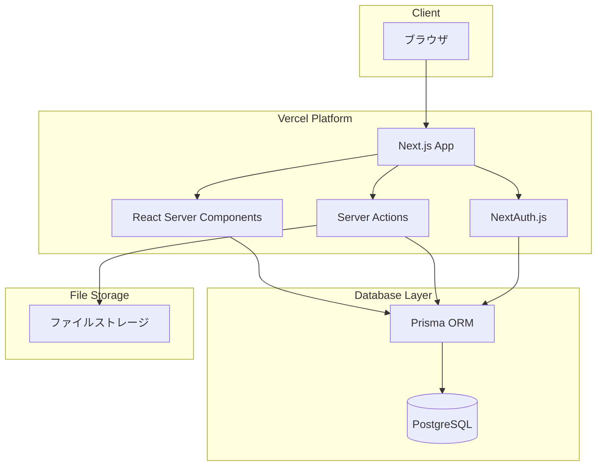

# 技術仕様書（Architecture Design Document）

## 概要

草野球チーム Albatross（Alba）の管理 Web アプリケーションの技術仕様を定義します。

---

## 技術方針

本プロジェクトでは、React および Next.js の最新機能を積極的に採用します。

### 採用する最新技術・パターン

- **React Server Components (RSC)**: サーバーサイドでのコンポーネントレンダリング
- **Server Actions**: フォーム処理やデータ変更をサーバーサイドで実行
- **Streaming / Suspense**: 段階的なコンテンツ表示による UX 向上
- **Parallel Routes / Intercepting Routes**: 高度なルーティングパターン
- **React 19 の新機能**: `use` フック、Actions、`useOptimistic` など

### 方針

- 新機能が安定版としてリリースされた場合、積極的に導入を検討する
- 実験的機能（Canary）は本番環境では使用しない
- 破壊的変更を伴うアップデートは、十分なテストを経て適用する

---

## テクノロジースタック

### フロントエンド

| カテゴリ       | 技術           | バージョン | 用途                              | 選定理由                                                   |
| -------------- | -------------- | ---------- | --------------------------------- | ---------------------------------------------------------- |
| フレームワーク | Next.js        | 16.x       | フルスタック React フレームワーク | App Router、RSC、Server Actions による効率的な開発         |
| UI ライブラリ  | React          | 19.x       | ユーザーインターフェース構築      | 最新の React 機能（Server Components、Actions）を活用      |
| スタイリング   | Tailwind CSS   | 4.x        | ユーティリティファースト CSS      | 高速なスタイリング、レスポンシブ対応が容易                 |
| CSS プロセッサ | PostCSS        | 8.x        | CSS 変換・最適化                  | Tailwind CSS との統合                                      |
| 言語           | TypeScript     | 5.x        | 型安全な JavaScript               | 静的型付けによるバグ検出、IDE 補完の向上                   |
| 日付処理       | @formkit/tempo | 1.x        | 日付・時刻の処理                  | 軽量で TypeScript フレンドリーな日付ライブラリ             |

### バックエンド

| カテゴリ     | 技術               | バージョン | 用途                       | 選定理由                                         |
| ------------ | ------------------ | ---------- | -------------------------- | ------------------------------------------------ |
| ORM          | Prisma             | 7.x        | データベース操作           | 型安全なクエリ、マイグレーション管理が容易       |
| データベース | PostgreSQL         | 17         | リレーショナルデータベース | 信頼性が高く、Vercel Postgres との親和性         |
| DB アダプタ  | @prisma/adapter-pg | 7.x        | PostgreSQL 接続            | Prisma と PostgreSQL の接続                      |
| DB ドライバ  | pg                 | 8.x        | PostgreSQL ドライバ        | Node.js 標準の PostgreSQL ドライバ               |
| 認証         | NextAuth.js        | 5.x        | 認証・セッション管理       | Next.js との統合が容易、RBAC 実装のベース        |

### 開発環境

| カテゴリ         | 技術                   | バージョン | 用途                       | 選定理由                                     |
| ---------------- | ---------------------- | ---------- | -------------------------- | -------------------------------------------- |
| ランタイム       | Node.js                | 24.x (LTS) | JavaScript 実行環境        | 長期サポート、最新の V8 エンジン             |
| パッケージ管理   | pnpm                   | 10.x       | 高速なパッケージマネージャ | 高速インストール、ディスク効率               |
| コンテナ         | Docker Compose         | -          | ローカル DB 環境構築       | 開発環境の統一                               |
| リンター         | Biome                  | 2.x        | コード品質・フォーマット   | ESLint + Prettier を 1 ツールで代替、高速    |
| 未使用検出       | Knip                   | 5.x        | 未使用コード検出           | 不要なコード・依存関係の検出                 |
| テスト           | Vitest                 | 4.x        | ユニットテスト             | 高速、TypeScript ネイティブサポート          |
| テストライブラリ | @testing-library/react | 16.x       | React コンポーネントテスト | ユーザー視点でのテスト                       |
| E2E テスト       | Playwright             | 1.x        | E2E テスト                 | クロスブラウザ対応、高速                     |
| TypeScript 実行  | tsx                    | 4.x        | TypeScript 直接実行        | 開発時の TypeScript スクリプト実行           |

---

## アーキテクチャパターン

### Next.js App Router アーキテクチャ

```
┌─────────────────────────────────────────────────────┐
│                    クライアント                      │
│              (モバイル / PC ブラウザ)                │
└─────────────────────────────────────────────────────┘
                         │
                         ▼
┌─────────────────────────────────────────────────────┐
│                   Next.js App Router                 │
├─────────────────────────────────────────────────────┤
│  ┌─────────────────────────────────────────────┐   │
│  │         React Server Components              │   │
│  │  ─────────────────────────────────────────  │   │
│  │  - ページコンポーネント                      │   │
│  │  - データフェッチ                            │   │
│  │  - SEO 最適化                               │   │
│  └─────────────────────────────────────────────┘   │
│                                                     │
│  ┌─────────────────────────────────────────────┐   │
│  │            Server Actions                    │   │
│  │  ─────────────────────────────────────────  │   │
│  │  - フォーム処理                              │   │
│  │  - データ変更操作                            │   │
│  │  - バリデーション                            │   │
│  └─────────────────────────────────────────────┘   │
│                                                     │
│  ┌─────────────────────────────────────────────┐   │
│  │         Client Components                    │   │
│  │  ─────────────────────────────────────────  │   │
│  │  - インタラクティブ UI                       │   │
│  │  - 状態管理                                  │   │
│  │  - イベントハンドリング                      │   │
│  └─────────────────────────────────────────────┘   │
└─────────────────────────────────────────────────────┘
                         │
                         ▼
┌─────────────────────────────────────────────────────┐
│                    Prisma ORM                        │
├─────────────────────────────────────────────────────┤
│  - 型安全なデータベース操作                          │
│  - マイグレーション管理                              │
│  - シード管理                                       │
└─────────────────────────────────────────────────────┘
                         │
                         ▼
┌─────────────────────────────────────────────────────┐
│                   PostgreSQL                         │
└─────────────────────────────────────────────────────┘
```

### レイヤー責務

#### UI レイヤー（Server Components / Client Components）

- **責務**: ユーザーインターフェースのレンダリング、インタラクション処理
- **許可される操作**: Server Actions の呼び出し、Client 状態の管理
- **禁止される操作**: Prisma への直接アクセス（Server Components を除く）

#### Server Actions レイヤー

- **責務**: データ変更操作、バリデーション、認可チェック
- **許可される操作**: Prisma を使用したデータベース操作
- **禁止される操作**: UI ロジックの実装

#### データレイヤー（Prisma）

- **責務**: データベースとのやり取り、クエリの実行
- **許可される操作**: SQL クエリの実行、トランザクション管理
- **禁止される操作**: ビジネスロジックの実装

---

## システム構成図



---

## データ永続化戦略

### ストレージ方式

| データ種別       | ストレージ        | フォーマット    | 理由                                           |
| ---------------- | ----------------- | --------------- | ---------------------------------------------- |
| ユーザー情報     | PostgreSQL        | リレーショナル  | ACID 準拠、参照整合性の保証                    |
| 試合・成績データ | PostgreSQL        | リレーショナル  | 複雑なリレーション、集計クエリのパフォーマンス |
| イベント情報     | PostgreSQL        | リレーショナル  | シーズンとの関連、日付による検索               |
| ドキュメント情報 | PostgreSQL        | リレーショナル  | メタデータ管理、カテゴリ分類                   |
| アップロードファイル | ファイルストレージ | バイナリ        | 大容量ファイルの効率的な保存                   |

### バックアップ戦略

- **頻度**: 日次（自動バックアップ）
- **保存先**: Vercel Postgres 自動バックアップ + 手動エクスポート
- **世代管理**: 最新 7 世代を保持
- **復元方法**: Vercel ダッシュボードからのリストア

---

## パフォーマンス要件

### レスポンスタイム

| 操作             | 目標時間   | 測定環境                    |
| ---------------- | ---------- | --------------------------- |
| 初期ページロード | 3 秒以内   | 3G 回線環境                 |
| ページ遷移       | 1 秒以内   | 4G / WiFi 環境              |
| Server Action    | 500ms 以内 | 4G / WiFi 環境              |
| データベースクエリ | 100ms 以内 | Vercel Edge / PostgreSQL    |

### Core Web Vitals

| 指標 | 目標値     | 説明                      |
| ---- | ---------- | ------------------------- |
| LCP  | 2.5 秒以内 | Largest Contentful Paint  |
| INP  | 200ms 以内 | Interaction to Next Paint |
| CLS  | 0.1 以下   | Cumulative Layout Shift   |

### リソース使用量

| リソース           | 上限       | 理由                               |
| ------------------ | ---------- | ---------------------------------- |
| JavaScript バンドル | 200KB 以下 | モバイル環境でのパフォーマンス維持 |
| 画像サイズ         | 500KB 以下 | ページ読み込み速度                 |
| データベース接続   | 10 接続    | Vercel 無料枠の制限                |

---

## セキュリティアーキテクチャ

### 認証・認可

- **認証方式**: NextAuth.js（Credentials Provider）
- **セッション管理**: JWT トークン（有効期限: 7 日間）
- **認可方式**: ロールベースアクセス制御（RBAC）

### データ保護

- **通信暗号化**: HTTPS（TLS 1.2 以上）
- **パスワード保存**: bcrypt によるハッシュ化（ソルト付き）
- **セッション**: HTTP Only Cookie、Secure フラグ

### 入力検証

- **バリデーション**: Server Actions 内で Zod によるスキーマ検証
- **サニタイゼーション**: XSS 対策（React の自動エスケープ）
- **CSRF 対策**: Server Actions の組み込み CSRF 保護

### 権限チェック

```typescript
// Server Action での権限チェック例
async function deleteGame(gameId: string) {
  const session = await getServerSession();

  if (!session?.user) {
    throw new Error("認証が必要です");
  }

  if (session.user.role !== "ADMIN") {
    throw new Error("管理者権限が必要です");
  }

  await prisma.game.delete({ where: { id: gameId } });
}
```

---

## スケーラビリティ設計

### データ増加への対応

- **想定データ量**: 5 年分の試合・成績データ（約 500 試合、10,000 件の成績レコード）
- **パフォーマンス劣化対策**:
  - 適切なインデックス設計（日付、シーズン、ユーザー ID）
  - ページネーションの実装
  - 必要に応じたキャッシュ（Next.js ISR / SWR）
- **アーカイブ戦略**: 当面は全データを保持（データ量が増加した場合に検討）

### 同時接続対応

- **想定同時接続**: 50 ユーザー以下（チーム規模を考慮）
- **対策**: Vercel のサーバーレス関数による自動スケーリング

---

## 開発ツールと手法

### コード品質管理

- **Biome**: リンティング・フォーマットを統合
  - インデント: スペース
  - 行幅: 80 文字
  - 相対パスインポート禁止（`@/` エイリアス使用）
- **Knip**: 未使用ファイル・エクスポートの検出
- **TypeScript**: strict モード有効

### テスト戦略

| テスト種別               | ツール                   | 対象範囲                       | カバレッジ目標 |
| ------------------------ | ------------------------ | ------------------------------ | -------------- |
| ユニットテスト           | Vitest + Testing Library | コンポーネント・ユーティリティ | 80%            |
| インテグレーションテスト | Vitest                   | Server Actions・データ層       | 70%            |
| E2E テスト               | Playwright               | 主要ユーザーフロー             | 主要フロー網羅 |

### デプロイメント

| 環境       | プラットフォーム | URL                   | デプロイ方法         |
| ---------- | ---------------- | --------------------- | -------------------- |
| 開発       | ローカル         | http://localhost:3000 | `pnpm dev`           |
| プレビュー | Vercel Preview   | PR ごとに自動生成     | PR 作成時に自動      |
| 本番       | Vercel           | （設定後に決定）      | main ブランチへのマージ |

---

## 技術的制約と要件

### ブラウザサポート

レスポンシブデザインを採用し、モバイル・デスクトップ両方に対応します。

| ブラウザ          | サポートバージョン |
| ----------------- | ------------------ |
| Chrome            | 最新バージョン     |
| Chrome (モバイル) | 最新バージョン     |
| Safari (iOS)      | 最新バージョン     |

### アクセシビリティ

| 項目                     | 要件       |
| ------------------------ | ---------- |
| WCAG 準拠レベル          | AA（目標） |
| キーボードナビゲーション | 対応       |
| スクリーンリーダー       | 対応       |

### 環境要件

- **ホスティング**: Vercel
- **データベース**: Vercel Postgres または外部 PostgreSQL
- **Node.js**: 24.x（Vercel 環境）

---

## 依存関係管理

### バージョン管理方針

| ライブラリ   | 用途               | バージョン管理方針 |
| ------------ | ------------------ | ------------------ |
| next         | フレームワーク     | メジャー固定       |
| react        | UI ライブラリ      | メジャー固定       |
| prisma       | ORM                | メジャー固定       |
| typescript   | 言語               | メジャー固定       |
| tailwindcss  | スタイリング       | メジャー固定       |
| biome        | リンター           | メジャー固定       |
| vitest       | テスト             | メジャー固定       |

### 更新ポリシー

- セキュリティアップデート: 即時対応
- バグ修正: 週次で確認・適用
- 機能追加: 月次で検討

---

## 更新履歴

| 日付       | 更新内容 | 更新者 |
| ---------- | -------- | ------ |
| 2025-01-12 | 初版作成 | -      |
