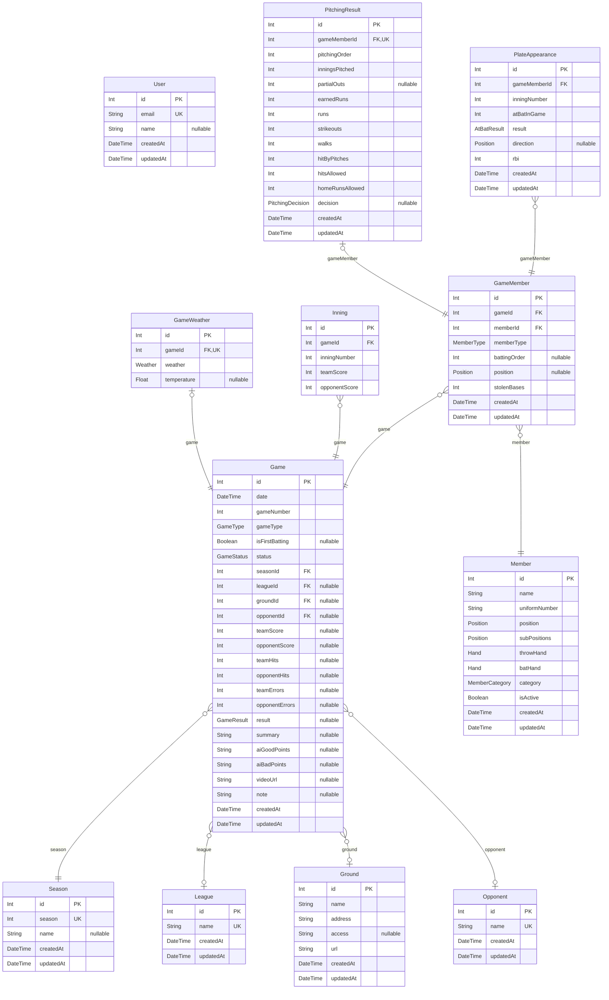

# Albatross

> Generated by [`prisma-markdown`](https://github.com/samchon/prisma-markdown)

- [default](#default)

## default

### `User`

Properties as follows:

- `id`:
- `email`:
- `name`:
- `createdAt`:
- `updatedAt`:

### `Season`

Properties as follows:

- `id`:
- `season`:
- `name`:
- `createdAt`:
- `updatedAt`:

### `League`

Properties as follows:

- `id`:
- `name`:
- `createdAt`:
- `updatedAt`:

### `Ground`

Properties as follows:

- `id`:
- `name`:
- `address`:
- `access`:
- `url`:
- `createdAt`:
- `updatedAt`:

### `Opponent`

Properties as follows:

- `id`:
- `name`:
- `createdAt`:
- `updatedAt`:

### `Member`

Properties as follows:

- `id`:
- `name`:
- `uniformNumber`:
- `position`:
- `subPositions`:
- `throwHand`:
- `batHand`:
- `category`:
- `isActive`:
- `createdAt`:
- `updatedAt`:

### `Game`

Properties as follows:

- `id`:
- `date`:
- `gameNumber`:
- `gameType`:
- `isFirstBatting`:
- `status`:
- `seasonId`:
- `leagueId`:
- `groundId`:
- `opponentId`:
- `teamScore`:
- `opponentScore`:
- `teamHits`:
- `opponentHits`:
- `teamErrors`:
- `opponentErrors`:
- `result`:
- `summary`:
- `aiGoodPoints`:
- `aiBadPoints`:
- `videoUrl`:
- `note`:
- `createdAt`:
- `updatedAt`:

### `GameWeather`

Properties as follows:

- `id`:
- `gameId`:
- `weather`:
- `temperature`:

### `Inning`

Properties as follows:

- `id`:
- `gameId`:
- `inningNumber`:
- `teamScore`:
- `opponentScore`:

### `GameMember`

Properties as follows:

- `id`:
- `gameId`:
- `memberId`:
- `memberType`:
- `battingOrder`:
- `position`:
- `stolenBases`:
- `createdAt`:
- `updatedAt`:

### `PitchingResult`

Properties as follows:

- `id`:
- `gameMemberId`:
- `pitchingOrder`:
- `inningsPitched`:
- `partialOuts`:
- `earnedRuns`:
- `runs`:
- `strikeouts`:
- `walks`:
- `hitByPitches`:
- `hitsAllowed`:
- `homeRunsAllowed`:
- `decision`:
- `createdAt`:
- `updatedAt`:

### `PlateAppearance`

Properties as follows:

- `id`:
- `gameMemberId`:
- `inningNumber`:
- `atBatInGame`:
- `result`:
- `direction`:
- `rbi`:
- `createdAt`:
- `updatedAt`:
