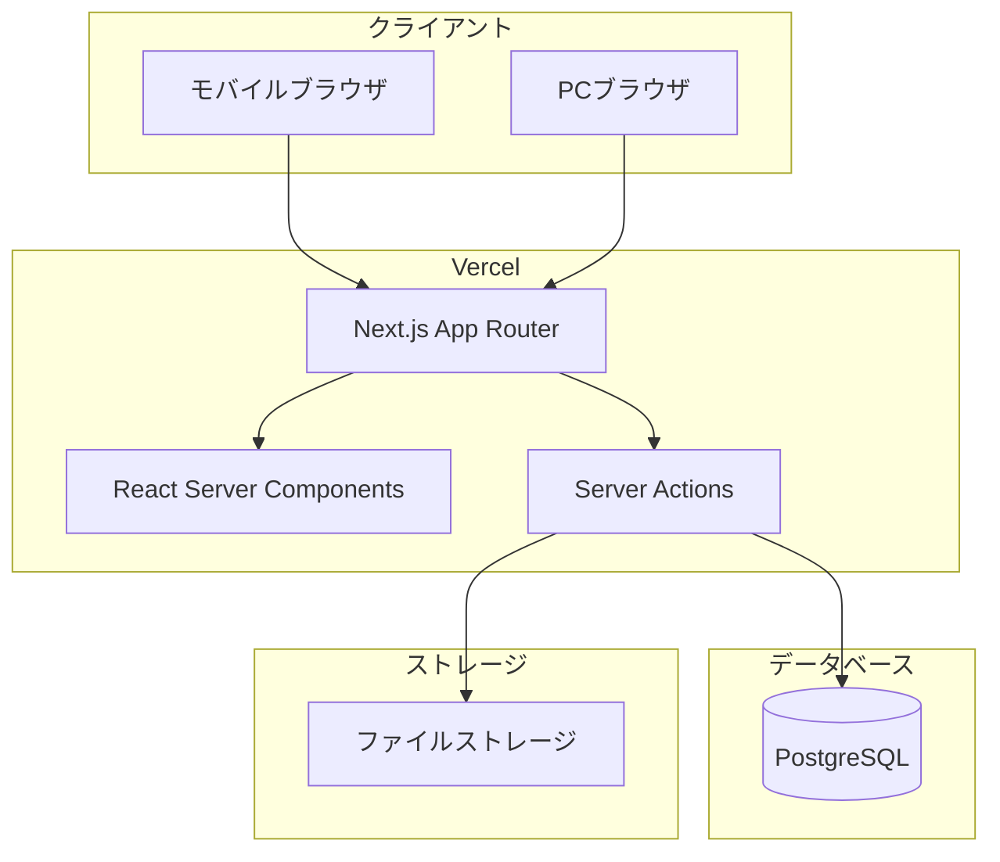
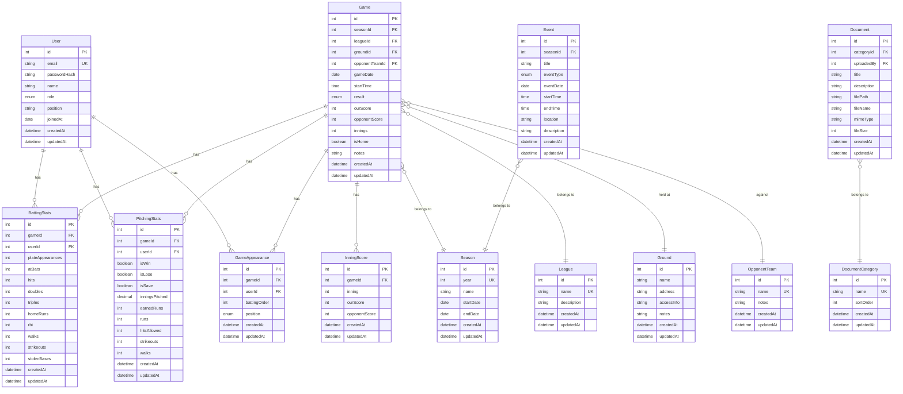
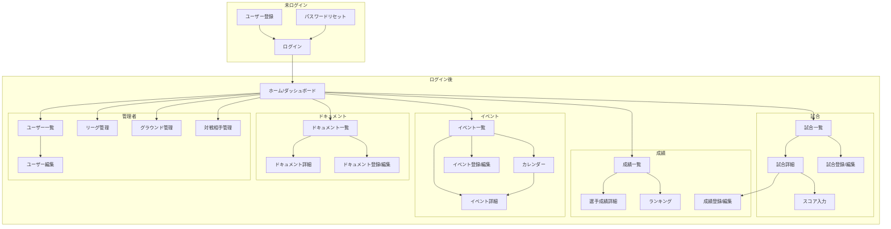

# 機能設計書（Functional Design）

## 概要

草野球チーム Albatross（Alba）の管理 Web アプリケーションの機能設計を定義します。

---

## システム構成図



---

## 機能アーキテクチャ

### 機能一覧と階層構造

```
├── 認証機能
│   ├── ユーザー登録
│   ├── ログイン / ログアウト
│   └── パスワード管理
│
├── ユーザー管理（管理者）
│   ├── ユーザー一覧
│   ├── 役割変更
│   └── ユーザー削除
│
├── マスタ管理
│   ├── リーグ管理
│   ├── グラウンド管理
│   └── 対戦相手チーム管理
│
├── 試合管理
│   ├── 試合登録 / 編集
│   ├── スコア入力
│   ├── 試合一覧 / 詳細
│   └── 試合削除
│
├── 成績管理
│   ├── 打撃成績登録 / 編集
│   ├── 投手成績登録 / 編集
│   ├── 成績一覧 / 詳細
│   ├── シーズン別集計
│   └── ランキング
│
├── イベント管理
│   ├── イベント登録 / 編集
│   ├── イベント一覧 / 詳細
│   ├── カレンダー表示
│   └── イベント削除
│
└── ドキュメント管理
    ├── ドキュメント登録 / 編集
    ├── ドキュメント一覧
    ├── ドキュメント閲覧 / ダウンロード
    └── ドキュメント削除
```

---

## データモデル定義

### ER 図



### エンティティ詳細

#### User（ユーザー）

| カラム名     | 型       | 制約         | 説明                       |
| ------------ | -------- | ------------ | -------------------------- |
| id           | int      | PK           | ユーザー ID                |
| email        | string   | UK, NOT NULL | メールアドレス             |
| passwordHash | string   | NOT NULL     | パスワードハッシュ         |
| name         | string   | NOT NULL     | 表示名                     |
| role         | enum     | NOT NULL     | 役割（ADMIN/STAFF/PLAYER） |
| position     | string   | NULL         | メインポジション           |
| joinedAt     | date     | NULL         | 入団日                     |
| createdAt    | datetime | NOT NULL     | 作成日時                   |
| updatedAt    | datetime | NOT NULL     | 更新日時                   |

#### Season（シーズン）

| カラム名  | 型       | 制約         | 説明             |
| --------- | -------- | ------------ | ---------------- |
| id        | int      | PK           | シーズン ID      |
| year      | int      | UK, NOT NULL | 年度（例: 2024） |
| name      | string   | NOT NULL     | シーズン名       |
| startDate | date     | NULL         | 開始日           |
| endDate   | date     | NULL         | 終了日           |
| createdAt | datetime | NOT NULL     | 作成日時         |
| updatedAt | datetime | NOT NULL     | 更新日時         |

#### League（リーグ）

| カラム名    | 型       | 制約         | 説明      |
| ----------- | -------- | ------------ | --------- |
| id          | int      | PK           | リーグ ID |
| name        | string   | UK, NOT NULL | リーグ名  |
| description | string   | NULL         | 説明      |
| createdAt   | datetime | NOT NULL     | 作成日時  |
| updatedAt   | datetime | NOT NULL     | 更新日時  |

#### Ground（グラウンド）

| カラム名   | 型       | 制約     | 説明          |
| ---------- | -------- | -------- | ------------- |
| id         | int      | PK       | グラウンド ID |
| name       | string   | NOT NULL | グラウンド名  |
| address    | string   | NULL     | 住所          |
| accessInfo | string   | NULL     | アクセス情報  |
| notes      | string   | NULL     | 備考          |
| createdAt  | datetime | NOT NULL | 作成日時      |
| updatedAt  | datetime | NOT NULL | 更新日時      |

#### OpponentTeam（対戦相手チーム）

| カラム名  | 型       | 制約         | 説明      |
| --------- | -------- | ------------ | --------- |
| id        | int      | PK           | チーム ID |
| name      | string   | UK, NOT NULL | チーム名  |
| notes     | string   | NULL         | 備考      |
| createdAt | datetime | NOT NULL     | 作成日時  |
| updatedAt | datetime | NOT NULL     | 更新日時  |

#### Game（試合）

| カラム名       | 型       | 制約     | 説明                      |
| -------------- | -------- | -------- | ------------------------- |
| id             | int      | PK       | 試合 ID                   |
| seasonId       | int      | FK       | シーズン ID               |
| leagueId       | int      | FK       | リーグ ID                 |
| groundId       | int      | FK       | グラウンド ID             |
| opponentTeamId | int      | FK       | 対戦相手チーム ID         |
| gameDate       | date     | NOT NULL | 試合日                    |
| startTime      | time     | NULL     | 開始時刻                  |
| result         | enum     | NULL     | 結果（WIN/LOSE/DRAW/TBD） |
| ourScore       | int      | NULL     | 自チーム得点              |
| opponentScore  | int      | NULL     | 相手チーム得点            |
| innings        | int      | NOT NULL | イニング数（5〜9）        |
| isHome         | boolean  | NOT NULL | ホームチームか            |
| notes          | string   | NULL     | 備考                      |
| createdAt      | datetime | NOT NULL | 作成日時                  |
| updatedAt      | datetime | NOT NULL | 更新日時                  |

#### InningScore（イニングスコア）

| カラム名      | 型       | 制約     | 説明           |
| ------------- | -------- | -------- | -------------- |
| id            | int      | PK       | ID             |
| gameId        | int      | FK       | 試合 ID        |
| inning        | int      | NOT NULL | イニング番号   |
| ourScore      | int      | NOT NULL | 自チーム得点   |
| opponentScore | int      | NOT NULL | 相手チーム得点 |
| createdAt     | datetime | NOT NULL | 作成日時       |
| updatedAt     | datetime | NOT NULL | 更新日時       |

#### GameAppearance（試合出場）

| カラム名     | 型       | 制約     | 説明        |
| ------------ | -------- | -------- | ----------- |
| id           | int      | PK       | ID          |
| gameId       | int      | FK       | 試合 ID     |
| userId       | int      | FK       | ユーザー ID |
| battingOrder | int      | NULL     | 打順        |
| position     | enum     | NOT NULL | ポジション  |
| createdAt    | datetime | NOT NULL | 作成日時    |
| updatedAt    | datetime | NOT NULL | 更新日時    |

#### BattingStats（打撃成績）

| カラム名         | 型       | 制約     | 説明        |
| ---------------- | -------- | -------- | ----------- |
| id               | int      | PK       | ID          |
| gameId           | int      | FK       | 試合 ID     |
| userId           | int      | FK       | ユーザー ID |
| plateAppearances | int      | NOT NULL | 打席数      |
| atBats           | int      | NOT NULL | 打数        |
| hits             | int      | NOT NULL | 安打        |
| doubles          | int      | NOT NULL | 二塁打      |
| triples          | int      | NOT NULL | 三塁打      |
| homeRuns         | int      | NOT NULL | 本塁打      |
| rbi              | int      | NOT NULL | 打点        |
| walks            | int      | NOT NULL | 四球        |
| strikeouts       | int      | NOT NULL | 三振        |
| stolenBases      | int      | NOT NULL | 盗塁        |
| createdAt        | datetime | NOT NULL | 作成日時    |
| updatedAt        | datetime | NOT NULL | 更新日時    |

#### PitchingStats（投手成績）

| カラム名       | 型       | 制約     | 説明        |
| -------------- | -------- | -------- | ----------- |
| id             | int      | PK       | ID          |
| gameId         | int      | FK       | 試合 ID     |
| userId         | int      | FK       | ユーザー ID |
| isWin          | boolean  | NOT NULL | 勝利        |
| isLose         | boolean  | NOT NULL | 敗戦        |
| isSave         | boolean  | NOT NULL | セーブ      |
| inningsPitched | decimal  | NOT NULL | 投球回      |
| earnedRuns     | int      | NOT NULL | 自責点      |
| runs           | int      | NOT NULL | 失点        |
| hitsAllowed    | int      | NOT NULL | 被安打      |
| strikeouts     | int      | NOT NULL | 奪三振      |
| walks          | int      | NOT NULL | 与四球      |
| createdAt      | datetime | NOT NULL | 作成日時    |
| updatedAt      | datetime | NOT NULL | 更新日時    |

#### Event（イベント）

| カラム名    | 型       | 制約     | 説明                              |
| ----------- | -------- | -------- | --------------------------------- |
| id          | int      | PK       | イベント ID                       |
| seasonId    | int      | FK       | シーズン ID                       |
| title       | string   | NOT NULL | タイトル                          |
| eventType   | enum     | NOT NULL | 種別（GAME/PRACTICE/PARTY/OTHER） |
| eventDate   | date     | NOT NULL | 開催日                            |
| startTime   | time     | NULL     | 開始時刻                          |
| endTime     | time     | NULL     | 終了時刻                          |
| location    | string   | NULL     | 場所                              |
| description | string   | NULL     | 説明                              |
| createdAt   | datetime | NOT NULL | 作成日時                          |
| updatedAt   | datetime | NOT NULL | 更新日時                          |

#### DocumentCategory（ドキュメントカテゴリ）

| カラム名  | 型       | 制約         | 説明        |
| --------- | -------- | ------------ | ----------- |
| id        | int      | PK           | カテゴリ ID |
| name      | string   | UK, NOT NULL | カテゴリ名  |
| sortOrder | int      | NOT NULL     | 表示順      |
| createdAt | datetime | NOT NULL     | 作成日時    |
| updatedAt | datetime | NOT NULL     | 更新日時    |

**固定カテゴリ:**

1. チーム規約・ルール
2. 試合関連資料
3. 会計・経費関連

#### Document（ドキュメント）

| カラム名    | 型       | 制約     | 説明                 |
| ----------- | -------- | -------- | -------------------- |
| id          | int      | PK       | ドキュメント ID      |
| categoryId  | int      | FK       | カテゴリ ID          |
| uploadedBy  | int      | FK       | アップロードユーザー |
| title       | string   | NOT NULL | タイトル             |
| description | string   | NULL     | 説明                 |
| filePath    | string   | NOT NULL | ファイルパス         |
| fileName    | string   | NOT NULL | ファイル名           |
| mimeType    | string   | NOT NULL | MIME タイプ          |
| fileSize    | int      | NOT NULL | ファイルサイズ       |
| createdAt   | datetime | NOT NULL | 作成日時             |
| updatedAt   | datetime | NOT NULL | 更新日時             |

### Enum 定義

```typescript
// ユーザー役割
enum UserRole {
  ADMIN   // 管理者
  STAFF   // 運営
  PLAYER  // 選手
}

// 試合結果
enum GameResult {
  WIN   // 勝ち
  LOSE  // 負け
  DRAW  // 引き分け
  TBD   // 未定
}

// ポジション
enum Position {
  PITCHER        // 投手
  CATCHER        // 捕手
  FIRST_BASE     // 一塁手
  SECOND_BASE    // 二塁手
  THIRD_BASE     // 三塁手
  SHORTSTOP      // 遊撃手
  LEFT_FIELD     // 左翼手
  CENTER_FIELD   // 中堅手
  RIGHT_FIELD    // 右翼手
  DESIGNATED     // 指名打者
}

// イベント種別
enum EventType {
  GAME     // 試合
  PRACTICE // 練習
  PARTY    // 懇親会
  OTHER    // その他
}
```

---

## 画面遷移図



---

## 画面一覧

### 共通

| 画面名             | パス             | 説明                        |
| ------------------ | ---------------- | --------------------------- |
| ログイン           | /login           | メール/パスワードでログイン |
| 新規登録           | /register        | 新規ユーザー登録            |
| パスワードリセット | /forgot-password | パスワードリセット要求      |

### メイン

| 画面名             | パス                 | 説明                   |
| ------------------ | -------------------- | ---------------------- |
| ホーム             | /                    | ダッシュボード         |
| 試合一覧           | /games               | 試合の一覧             |
| 試合詳細           | /games/[id]          | 試合の詳細情報とスコア |
| 試合登録           | /games/new           | 新規試合登録           |
| 試合編集           | /games/[id]/edit     | 試合情報編集           |
| 成績一覧           | /stats               | 選手成績一覧           |
| 選手成績詳細       | /stats/[userId]      | 選手個人の成績詳細     |
| ランキング         | /stats/ranking       | チーム内ランキング     |
| イベント一覧       | /events              | イベントの一覧         |
| イベントカレンダー | /events/calendar     | カレンダー表示         |
| イベント詳細       | /events/[id]         | イベントの詳細情報     |
| イベント登録       | /events/new          | 新規イベント登録       |
| イベント編集       | /events/[id]/edit    | イベント情報編集       |
| ドキュメント一覧   | /documents           | ドキュメントの一覧     |
| ドキュメント詳細   | /documents/[id]      | ドキュメントの詳細情報 |
| ドキュメント登録   | /documents/new       | 新規ドキュメント登録   |
| ドキュメント編集   | /documents/[id]/edit | ドキュメント編集       |

### 管理者専用

| 画面名         | パス              | 説明                   |
| -------------- | ----------------- | ---------------------- |
| ユーザー一覧   | /admin/users      | ユーザーの一覧と管理   |
| ユーザー編集   | /admin/users/[id] | ユーザー情報編集       |
| リーグ管理     | /admin/leagues    | リーグのマスタ管理     |
| グラウンド管理 | /admin/grounds    | グラウンドのマスタ管理 |
| 対戦相手管理   | /admin/teams      | 対戦相手のマスタ管理   |

---

## ワイヤーフレーム

### 共通レイアウト

```
┌─────────────────────────────────────────────────┐
│  ☰  Albatross                      [ユーザー名] │  ← ヘッダー（固定）
├─────────────────────────────────────────────────┤
│                                                 │
│                                                 │
│                                                 │
│              メインコンテンツ                    │
│                                                 │
│                                                 │
│                                                 │
└─────────────────────────────────────────────────┘

※ ☰ をタップするとサイドメニューが表示される
```

### ハンバーガーメニュー

```
┌─────────────────────────────────────────────────┐
│  ✕  メニュー                                    │
├─────────────────────────────────────────────────┤
│  🏠 ホーム                                      │
│  ⚾ 試合                                        │
│  📊 成績                                        │
│  📅 イベント                                    │
│  📄 ドキュメント                                │
├─────────────────────────────────────────────────┤
│  ⚙️ 管理（管理者のみ）                          │
│     └ ユーザー管理                              │
│     └ マスタ管理                                │
├─────────────────────────────────────────────────┤
│  👤 マイページ                                  │
│  🚪 ログアウト                                  │
└─────────────────────────────────────────────────┘
```

### ホーム（ダッシュボード）

```
┌─────────────────────────────────────────────────┐
│  ☰  Albatross                           👤     │
├─────────────────────────────────────────────────┤
│                                                 │
│  ┌───────────────────────────────────────────┐  │
│  │  📊 2024年度 成績サマリー                 │  │
│  │  ─────────────────────────────────────    │  │
│  │  10勝 5敗 2分  勝率.667                   │  │
│  └───────────────────────────────────────────┘  │
│                                                 │
│  ┌───────────────────────────────────────────┐  │
│  │  ⚾ 直近の試合結果                        │  │
│  │  ─────────────────────────────────────    │  │
│  │  1/5  vs チームA  ○ 5-3                   │  │
│  │  12/22 vs チームB  ● 2-4                  │  │
│  │                          [もっと見る →]   │  │
│  └───────────────────────────────────────────┘  │
│                                                 │
│  ┌───────────────────────────────────────────┐  │
│  │  📅 今後の予定                            │  │
│  │  ─────────────────────────────────────    │  │
│  │  1/12  練習  グラウンドA                  │  │
│  │  1/19  試合  vs チームC                   │  │
│  │                          [もっと見る →]   │  │
│  └───────────────────────────────────────────┘  │
│                                                 │
│  ┌─────────┐ ┌─────────┐ ┌─────────┐ ┌─────────┐│
│  │  ⚾    │ │  📊    │ │  📅    │ │  📄    ││
│  │  試合  │ │  成績  │ │ｲﾍﾞﾝﾄ  │ │ ﾄﾞｷｭ   ││
│  └─────────┘ └─────────┘ └─────────┘ └─────────┘│
└─────────────────────────────────────────────────┘
```

### 試合一覧

```
┌─────────────────────────────────────────────────┐
│  ←  試合一覧                            [+ 新規]│
├─────────────────────────────────────────────────┤
│                                                 │
│  [2024年度 ▼]  [全リーグ ▼]                     │
│                                                 │
│  ┌───────────────────────────────────────────┐  │
│  │  1月5日(日)  Aリーグ                      │  │
│  │  ─────────────────────────────────────    │  │
│  │  Albatross  5 - 3  チームA                │  │
│  │  ○ 勝ち  グラウンドA                      │  │
│  └───────────────────────────────────────────┘  │
│                                                 │
│  ┌───────────────────────────────────────────┐  │
│  │  12月22日(日)  Bリーグ                    │  │
│  │  ─────────────────────────────────────    │  │
│  │  チームB  4 - 2  Albatross                │  │
│  │  ● 負け  グラウンドB                      │  │
│  └───────────────────────────────────────────┘  │
│                                                 │
│  ┌───────────────────────────────────────────┐  │
│  │  12月15日(日)  Aリーグ                    │  │
│  │  ─────────────────────────────────────    │  │
│  │  Albatross  3 - 3  チームC                │  │
│  │  △ 引き分け  グラウンドC                  │  │
│  └───────────────────────────────────────────┘  │
│                                                 │
└─────────────────────────────────────────────────┘
```

### 試合詳細

```
┌─────────────────────────────────────────────────┐
│  ←  試合詳細                            [編集]  │
├─────────────────────────────────────────────────┤
│                                                 │
│  2024年1月5日(日) 10:00〜                       │
│  Aリーグ / グラウンドA                          │
│                                                 │
│  ┌───────────────────────────────────────────┐  │
│  │         1  2  3  4  5  6  7    計         │  │
│  │  ─────────────────────────────────────    │  │
│  │  チームA  0  1  0  0  2  0  0     3       │  │
│  │  Alba     1  0  2  0  1  0  1     5       │  │
│  └───────────────────────────────────────────┘  │
│                                                 │
│  [打撃成績]  [投手成績]                         │
│                                                 │
│  ┌───────────────────────────────────────────┐  │
│  │  打順  選手名    打席 打数 安打 打点       │  │
│  │  ─────────────────────────────────────    │  │
│  │   1    山田太郎   4    3    2    1        │  │
│  │   2    鈴木一郎   4    4    1    0        │  │
│  │   3    佐藤花子   3    2    1    2        │  │
│  │   ...                                     │  │
│  └───────────────────────────────────────────┘  │
│                                                 │
│              [成績を編集する]                   │
│                                                 │
└─────────────────────────────────────────────────┘
```

---

## コンポーネント設計

### 共通コンポーネント

| コンポーネント名 | 説明                       |
| ---------------- | -------------------------- |
| Header           | ヘッダー（ロゴ、メニュー） |
| HamburgerMenu    | ハンバーガーメニュー       |
| Footer           | フッター                   |
| Button           | ボタン                     |
| Input            | テキスト入力               |
| Select           | セレクトボックス           |
| Card             | カード                     |
| Table            | テーブル                   |
| Modal            | モーダル                   |
| Toast            | トースト通知               |
| Loading          | ローディング表示           |
| ErrorMessage     | エラーメッセージ           |
| EmptyState       | 空状態表示                 |
| Pagination       | ページネーション           |

### 機能コンポーネント

| コンポーネント名  | 説明                 |
| ----------------- | -------------------- |
| GameCard          | 試合カード           |
| GameScoreBoard    | スコアボード         |
| GameScoreInput    | スコア入力フォーム   |
| StatsTable        | 成績テーブル         |
| BattingStatsForm  | 打撃成績入力フォーム |
| PitchingStatsForm | 投手成績入力フォーム |
| RankingList       | ランキングリスト     |
| EventCard         | イベントカード       |
| EventCalendar     | カレンダー           |
| DocumentCard      | ドキュメントカード   |
| FileUploader      | ファイルアップロード |
| UserCard          | ユーザーカード       |
| SeasonSelector    | シーズン選択         |
| LeagueSelector    | リーグ選択           |

---

## デザインシステム

### カラーパレット

| 名前      | カラーコード | 用途                         |
| --------- | ------------ | ---------------------------- |
| Primary   | #00053a      | メインカラー、ボタン、リンク |
| Secondary | #9e8f42      | アクセントカラー             |
| Black     | #333333      | テキスト                     |
| White     | #ffffff      | 背景                         |
| Gray-100  | #f5f5f5      | 背景（セカンダリ）           |
| Gray-300  | #d4d4d4      | ボーダー                     |
| Gray-500  | #737373      | プレースホルダー             |
| Success   | #22c55e      | 成功、勝ち                   |
| Error     | #ef4444      | エラー、負け                 |
| Warning   | #f59e0b      | 警告                         |

### タイポグラフィ

| 用途         | サイズ | ウェイト |
| ------------ | ------ | -------- |
| 見出し h1    | 24px   | Bold     |
| 見出し h2    | 20px   | Bold     |
| 見出し h3    | 16px   | Bold     |
| 本文         | 14px   | Normal   |
| キャプション | 12px   | Normal   |

### スペーシング

4px を基準とした 4 の倍数を使用

| サイズ | 値   |
| ------ | ---- |
| xs     | 4px  |
| sm     | 8px  |
| md     | 16px |
| lg     | 24px |
| xl     | 32px |
| 2xl    | 48px |

### ブレークポイント

| 名前 | 値     | 用途               |
| ---- | ------ | ------------------ |
| sm   | 640px  | スマートフォン     |
| md   | 768px  | タブレット         |
| lg   | 1024px | デスクトップ       |
| xl   | 1280px | ワイドデスクトップ |

---

## API 設計

本アプリケーションは Next.js の Server Actions を使用するため、従来の REST API は使用しません。
以下は Server Actions の設計です。

### 認証

| Action 名      | 説明                   |
| -------------- | ---------------------- |
| signUp         | ユーザー登録           |
| signIn         | ログイン               |
| signOut        | ログアウト             |
| resetPassword  | パスワードリセット要求 |
| updatePassword | パスワード更新         |

### ユーザー管理

| Action 名  | 説明             |
| ---------- | ---------------- |
| getUsers   | ユーザー一覧取得 |
| getUser    | ユーザー詳細取得 |
| updateUser | ユーザー更新     |
| deleteUser | ユーザー削除     |

### マスタ管理

| Action 名          | 説明               |
| ------------------ | ------------------ |
| getSeasons         | シーズン一覧取得   |
| createSeason       | シーズン作成       |
| getLeagues         | リーグ一覧取得     |
| createLeague       | リーグ作成         |
| updateLeague       | リーグ更新         |
| deleteLeague       | リーグ削除         |
| getGrounds         | グラウンド一覧取得 |
| createGround       | グラウンド作成     |
| updateGround       | グラウンド更新     |
| deleteGround       | グラウンド削除     |
| getOpponentTeams   | 対戦相手一覧取得   |
| createOpponentTeam | 対戦相手作成       |
| updateOpponentTeam | 対戦相手更新       |
| deleteOpponentTeam | 対戦相手削除       |

### 試合管理

| Action 名          | 説明               |
| ------------------ | ------------------ |
| getGames           | 試合一覧取得       |
| getGame            | 試合詳細取得       |
| createGame         | 試合作成           |
| updateGame         | 試合更新           |
| deleteGame         | 試合削除           |
| updateInningScores | イニングスコア更新 |

### 成績管理

| Action 名           | 説明               |
| ------------------- | ------------------ |
| getBattingStats     | 打撃成績取得       |
| createBattingStats  | 打撃成績作成       |
| updateBattingStats  | 打撃成績更新       |
| deleteBattingStats  | 打撃成績削除       |
| getPitchingStats    | 投手成績取得       |
| createPitchingStats | 投手成績作成       |
| updatePitchingStats | 投手成績更新       |
| deletePitchingStats | 投手成績削除       |
| getPlayerStats      | 選手成績集計取得   |
| getTeamStats        | チーム成績集計取得 |
| getRanking          | ランキング取得     |

### イベント管理

| Action 名   | 説明             |
| ----------- | ---------------- |
| getEvents   | イベント一覧取得 |
| getEvent    | イベント詳細取得 |
| createEvent | イベント作成     |
| updateEvent | イベント更新     |
| deleteEvent | イベント削除     |

### ドキュメント管理

| Action 名      | 説明                     |
| -------------- | ------------------------ |
| getDocuments   | ドキュメント一覧取得     |
| getDocument    | ドキュメント詳細取得     |
| uploadDocument | ドキュメントアップロード |
| updateDocument | ドキュメント更新         |
| deleteDocument | ドキュメント削除         |

---

## 更新履歴

| 日付       | 更新内容 | 更新者 |
| ---------- | -------- | ------ |
| 2025-01-11 | 初版作成 | -      |
