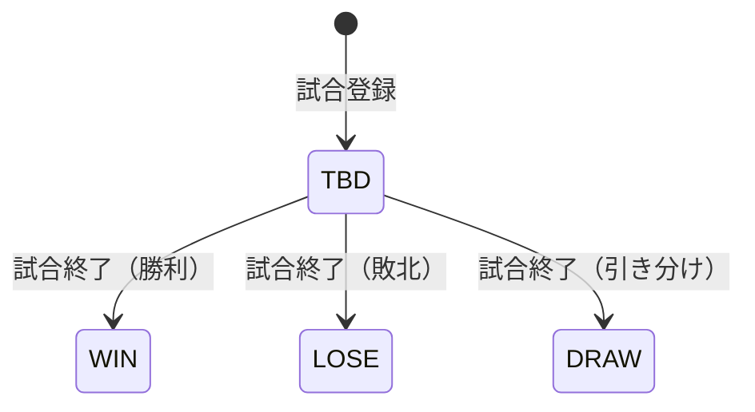

# プロジェクト用語集 (Glossary)

## 概要

このドキュメントは、Albatross プロジェクト内で使用される用語の定義を管理します。

**更新日**: 2025-01-12

---

## ドメイン用語

プロジェクト固有のビジネス概念や機能に関する用語。

### 試合 (Game)

**定義**: Albatross チームが参加する野球の試合

**説明**: 試合は日時、場所（グラウンド）、対戦相手チーム、所属リーグ、イニングごとの得点などの情報を持ちます。試合には選手の打撃成績・投手成績が紐づきます。

**関連用語**: [イニングスコア](#イニングスコア-inningscore)、[打撃成績](#打撃成績-battingstats)、[投手成績](#投手成績-pitchingstats)

**使用例**:

- 「試合を登録する」: 新しい試合情報をシステムに入力する
- 「試合結果を確認する」: 過去の試合のスコアや成績を閲覧する

**英語表記**: Game

### イニングスコア (InningScore)

**定義**: 試合の各イニングにおける両チームの得点

**説明**: 1回から最終回までの各イニングの得点を記録します。ホームチームか先攻かで表裏の概念があります。

**関連用語**: [試合](#試合-game)

**使用例**:

- 「3回表の得点を入力する」

**英語表記**: Inning Score

### 打撃成績 (BattingStats)

**定義**: 選手の打撃に関する成績データ

**説明**: 試合ごとに記録される選手の打撃成績。打席数、打数、安打、二塁打、三塁打、本塁打、打点、四球、三振、盗塁などを含みます。

**関連用語**: [試合](#試合-game)、[選手](#選手-player)、[打率](#打率-batting-average)

**主要フィールド**:

| フィールド       | 説明   |
| ---------------- | ------ |
| plateAppearances | 打席数 |
| atBats           | 打数   |
| hits             | 安打   |
| doubles          | 二塁打 |
| triples          | 三塁打 |
| homeRuns         | 本塁打 |
| rbi              | 打点   |
| walks            | 四球   |
| strikeouts       | 三振   |
| stolenBases      | 盗塁   |

**英語表記**: Batting Stats

### 投手成績 (PitchingStats)

**定義**: 選手の投手としての成績データ

**説明**: 試合ごとに記録される投手成績。勝敗、セーブ、投球回、自責点、失点、被安打、奪三振、与四球などを含みます。

**関連用語**: [試合](#試合-game)、[選手](#選手-player)、[防御率](#防御率-era)

**主要フィールド**:

| フィールド     | 説明   |
| -------------- | ------ |
| isWin          | 勝利   |
| isLose         | 敗戦   |
| isSave         | セーブ |
| inningsPitched | 投球回 |
| earnedRuns     | 自責点 |
| runs           | 失点   |
| hitsAllowed    | 被安打 |
| strikeouts     | 奪三振 |
| walks          | 与四球 |

**英語表記**: Pitching Stats

### シーズン (Season)

**定義**: 年度単位の活動期間

**説明**: 野球のシーズンを表す期間。通常は1年単位で管理され、成績の集計や表示のフィルタに使用されます。

**関連用語**: [試合](#試合-game)、[イベント](#イベント-event)

**使用例**:

- 「2024年度シーズンの成績を表示する」

**英語表記**: Season

### リーグ (League)

**定義**: チームが参加している野球リーグ

**説明**: 草野球では複数のリーグに参加することがあります。リーグごとに試合を分類し、成績を集計できます。

**関連用語**: [試合](#試合-game)

**使用例**:

- 「Aリーグの試合結果を表示する」

**英語表記**: League

### グラウンド (Ground)

**定義**: 試合や練習を行う野球場

**説明**: グラウンドの名称、住所、アクセス情報などを管理します。

**関連用語**: [試合](#試合-game)、[イベント](#イベント-event)

**英語表記**: Ground

### 対戦相手チーム (OpponentTeam)

**定義**: 試合で対戦する相手チーム

**説明**: 過去に対戦したチームや今後対戦予定のチームの情報を管理します。

**関連用語**: [試合](#試合-game)

**英語表記**: Opponent Team

### イベント (Event)

**定義**: チームの活動に関するイベント

**説明**: 試合、練習、懇親会、その他のチーム活動を管理します。日時、場所、内容などの情報を持ちます。

**関連用語**: [シーズン](#シーズン-season)、[イベント種別](#イベント種別-eventtype)

**使用例**:

- 「来週の練習イベントを登録する」
- 「今後のイベント一覧をカレンダーで確認する」

**英語表記**: Event

### ドキュメント (Document)

**定義**: チームの各種資料

**説明**: チーム規約・ルール、試合関連資料、会計・経費関連の資料を管理します。ファイルをアップロードし、カテゴリごとに分類できます。

**関連用語**: [ドキュメントカテゴリ](#ドキュメントカテゴリ-documentcategory)

**英語表記**: Document

### 選手 (Player)

**定義**: Albatross チームのメンバーで、試合に出場する人

**説明**: ユーザーの中で「選手」ロールを持つ人。成績の閲覧が主な利用目的です。

**関連用語**: [ユーザー](#ユーザー-user)、[打撃成績](#打撃成績-battingstats)、[投手成績](#投手成績-pitchingstats)

**英語表記**: Player

---

## ステータス・状態

システム内で使用される各種ステータスの定義。

### 試合結果 (GameResult)

**定義**: 試合の勝敗を示すステータス

**取りうる値**:

| ステータス | 意味       | 説明                   |
| ---------- | ---------- | ---------------------- |
| WIN        | 勝ち       | Albatross が勝利       |
| LOSE       | 負け       | Albatross が敗北       |
| DRAW       | 引き分け   | 同点で終了             |
| TBD        | 未定       | まだ試合が行われていない |

**状態遷移図**:



### ユーザー役割 (UserRole)

**定義**: ユーザーの権限レベルを示すロール

**取りうる値**:

| ロール | 意味   | 権限                               |
| ------ | ------ | ---------------------------------- |
| ADMIN  | 管理者 | 全機能へのフルアクセス、ユーザー管理 |
| STAFF  | 運営   | データの閲覧・作成・編集           |
| PLAYER | 選手   | データの閲覧のみ                   |

**権限マトリックス**:

| 操作           | ADMIN | STAFF | PLAYER |
| -------------- | ----- | ----- | ------ |
| データ閲覧     | ○     | ○     | ○      |
| データ作成・編集 | ○     | ○     | ×      |
| データ削除     | ○     | ×     | ×      |
| ユーザー管理   | ○     | ×     | ×      |

### イベント種別 (EventType)

**定義**: イベントの種類を示す分類

**取りうる値**:

| 種別     | 意味   | 説明                     |
| -------- | ------ | ------------------------ |
| GAME     | 試合   | 公式試合や練習試合       |
| PRACTICE | 練習   | チーム練習               |
| PARTY    | 懇親会 | 打ち上げや懇親イベント   |
| OTHER    | その他 | 上記に分類されないイベント |

### ポジション (Position)

**定義**: 野球のフィールドポジション

**取りうる値**:

| 値           | 日本語名 | 略称 |
| ------------ | -------- | ---- |
| PITCHER      | 投手     | P    |
| CATCHER      | 捕手     | C    |
| FIRST_BASE   | 一塁手   | 1B   |
| SECOND_BASE  | 二塁手   | 2B   |
| THIRD_BASE   | 三塁手   | 3B   |
| SHORTSTOP    | 遊撃手   | SS   |
| LEFT_FIELD   | 左翼手   | LF   |
| CENTER_FIELD | 中堅手   | CF   |
| RIGHT_FIELD  | 右翼手   | RF   |
| DESIGNATED   | 指名打者 | DH   |

### ドキュメントカテゴリ (DocumentCategory)

**定義**: ドキュメントの分類カテゴリ

**取りうる値（固定）**:

| カテゴリ           | 説明                     |
| ------------------ | ------------------------ |
| チーム規約・ルール | チームの規約、ルール、マニュアル |
| 試合関連資料       | リーグ規定、グラウンド情報など |
| 会計・経費関連     | 会費、経費精算、予算などの財務資料 |

---

## 計算・アルゴリズム

成績計算に関する用語。

### 打率 (Batting Average)

**定義**: 打数に対する安打数の割合

**計算式**:

```
打率 = 安打数 / 打数
```

**説明**: 打数が0の場合は計算不可（.000として扱う）。通常は小数点以下3桁で表示（例: .300）。

**実装箇所**: `src/app/_utils/stats/battingStats.ts`

**例**:

```
入力: 打数 100、安打 30
出力: 0.300（打率3割）
```

### 出塁率 (On-Base Percentage)

**定義**: 打席に対する出塁数の割合

**計算式**:

```
出塁率 = (安打 + 四球) / 打席数
```

**英語表記**: OBP (On-Base Percentage)

### 長打率 (Slugging Percentage)

**定義**: 打数に対する塁打数の割合

**計算式**:

```
塁打数 = 安打 + 二塁打 + (三塁打 × 2) + (本塁打 × 3)
長打率 = 塁打数 / 打数
```

**英語表記**: SLG (Slugging Percentage)

### OPS

**定義**: 出塁率と長打率の合計

**計算式**:

```
OPS = 出塁率 + 長打率
```

**説明**: 打者の総合的な攻撃力を示す指標。

**英語表記**: OPS (On-base Plus Slugging)

### 防御率 (ERA)

**定義**: 9イニングあたりの自責点数

**計算式**:

```
防御率 = (自責点 / 投球回) × 9
```

**説明**: 投手の実力を示す代表的な指標。数値が低いほど優秀。

**英語表記**: ERA (Earned Run Average)

### WHIP

**定義**: 1イニングあたりの被安打と与四球の合計

**計算式**:

```
WHIP = (被安打 + 与四球) / 投球回
```

**説明**: 投手がどれだけ走者を出しているかを示す指標。数値が低いほど優秀。

**英語表記**: WHIP (Walks plus Hits per Inning Pitched)

### 勝率

**定義**: 勝利数に対する試合数の割合

**計算式**:

```
勝率 = 勝利数 / (勝利数 + 敗北数)
```

**説明**: 引き分けは勝率の計算に含めません。

---

## データモデル用語

データベース・データ構造に関する用語。

### ユーザー (User)

**定義**: システムを利用するアカウント

**説明**: メールアドレスとパスワードで認証を行い、役割（ADMIN/STAFF/PLAYER）に応じた権限を持ちます。

**主要フィールド**:

- `id`: ユーザーID
- `email`: メールアドレス（ユニーク）
- `name`: 表示名
- `role`: 役割（UserRole）
- `position`: メインポジション

**関連エンティティ**: [打撃成績](#打撃成績-battingstats)、[投手成績](#投手成績-pitchingstats)

### 試合出場 (GameAppearance)

**定義**: 特定の試合における選手の出場記録

**説明**: どの試合に、どの選手が、どの打順・ポジションで出場したかを記録します。

**主要フィールド**:

- `gameId`: 試合ID
- `userId`: ユーザーID
- `battingOrder`: 打順
- `position`: ポジション

---

## 技術用語

プロジェクトで使用している技術・フレームワーク・ツールに関する用語。

### Next.js

**定義**: React ベースのフルスタック Web フレームワーク

**公式サイト**: https://nextjs.org/

**本プロジェクトでの用途**: アプリケーション全体のフレームワークとして使用。App Router、React Server Components、Server Actions を活用。

**バージョン**: 16.x

**関連ドキュメント**: [architecture.md](./architecture.md)

### React Server Components (RSC)

**定義**: サーバーサイドでレンダリングされる React コンポーネント

**説明**: データフェッチをサーバーで行い、クライアントに送信する JavaScript を削減できます。

**本プロジェクトでの用途**: ページコンポーネントやデータ取得を伴うコンポーネントに使用。

### Server Actions

**定義**: サーバーサイドで実行されるフォーム処理関数

**説明**: `"use server"` ディレクティブを使用して定義。フォーム送信やデータ変更処理をサーバーで実行。

**本プロジェクトでの用途**: 試合登録、成績入力、イベント作成などのデータ変更処理に使用。

### Prisma

**定義**: Node.js/TypeScript 向けの型安全な ORM

**公式サイト**: https://www.prisma.io/

**本プロジェクトでの用途**: PostgreSQL データベースとの接続、型安全なクエリ実行、マイグレーション管理。

**バージョン**: 7.x

**設定ファイル**: `prisma/schema.prisma`

### PostgreSQL

**定義**: オープンソースのリレーショナルデータベース

**公式サイト**: https://www.postgresql.org/

**本プロジェクトでの用途**: アプリケーションのメインデータベース。

**バージョン**: 17

### Tailwind CSS

**定義**: ユーティリティファーストの CSS フレームワーク

**公式サイト**: https://tailwindcss.com/

**本プロジェクトでの用途**: コンポーネントのスタイリング。レスポンシブデザインの実装。

**バージョン**: 4.x

### Biome

**定義**: JavaScript/TypeScript 向けの高速なリンター・フォーマッター

**公式サイト**: https://biomejs.dev/

**本プロジェクトでの用途**: コード品質チェックとフォーマットの統一。ESLint + Prettier の代替。

**バージョン**: 2.x

**設定ファイル**: `biome.json`

### Vitest

**定義**: Vite ベースの高速なテストフレームワーク

**公式サイト**: https://vitest.dev/

**本プロジェクトでの用途**: ユニットテスト、統合テストの実行。

**バージョン**: 4.x

**設定ファイル**: `vitest.config.ts`

### Playwright

**定義**: クロスブラウザ対応の E2E テストフレームワーク

**公式サイト**: https://playwright.dev/

**本プロジェクトでの用途**: E2E テスト、主要ユーザーフローの自動テスト。

**バージョン**: 1.x

---

## 略語・頭字語

### RBAC

**正式名称**: Role-Based Access Control

**意味**: ロールベースアクセス制御

**本プロジェクトでの使用**: ユーザーの役割（ADMIN/STAFF/PLAYER）に基づいて機能へのアクセスを制御。

### ORM

**正式名称**: Object-Relational Mapping

**意味**: オブジェクト関係マッピング

**本プロジェクトでの使用**: Prisma を使用してデータベースとのやり取りを型安全に行う。

### RSC

**正式名称**: React Server Components

**意味**: サーバーサイドで実行される React コンポーネント

**本プロジェクトでの使用**: データフェッチを伴うページやコンポーネントに使用。

### PR

**正式名称**: Pull Request

**意味**: コードの変更をレビュー・マージするためのリクエスト

**本プロジェクトでの使用**: 全てのコード変更は PR を通じてレビューを受ける。

### CI/CD

**正式名称**: Continuous Integration / Continuous Deployment

**意味**: 継続的インテグレーション / 継続的デプロイメント

**本プロジェクトでの使用**: GitHub Actions でテスト・ビルドを自動実行。Vercel で自動デプロイ。

---

## アーキテクチャ用語

システム設計・アーキテクチャに関する用語。

### App Router

**定義**: Next.js 13 以降で導入されたファイルベースのルーティングシステム

**本プロジェクトでの適用**: `src/app/` ディレクトリ配下でページを構成。Route Groups、Dynamic Routes を活用。

**関連コンポーネント**: 全てのページコンポーネント

### Route Group

**定義**: URL パスに影響を与えずにルートをグループ化する機能

**本プロジェクトでの適用**: `(public)` と `(private)` で認証要否によるページのグループ化。

**表記**: ディレクトリ名を括弧で囲む（例: `(public)`）

### レイヤードアーキテクチャ

**定義**: システムを役割ごとに複数の層に分割する設計パターン

**本プロジェクトでの適用**:

```
UI レイヤー (Server/Client Components)
    ↓
Server Actions レイヤー (_actions/)
    ↓
データレイヤー (Prisma)
```

**メリット**:

- 関心の分離による保守性向上
- 各層を独立してテスト可能
- 変更の影響範囲が限定的

---

## 索引

### あ行

- [イニングスコア](#イニングスコア-inningscore) - ドメイン用語
- [イベント](#イベント-event) - ドメイン用語
- [イベント種別](#イベント種別-eventtype) - ステータス

### か行

- [グラウンド](#グラウンド-ground) - ドメイン用語
- [勝率](#勝率) - 計算

### さ行

- [シーズン](#シーズン-season) - ドメイン用語
- [試合](#試合-game) - ドメイン用語
- [試合結果](#試合結果-gameresult) - ステータス
- [試合出場](#試合出場-gameappearance) - データモデル
- [出塁率](#出塁率-on-base-percentage) - 計算
- [選手](#選手-player) - ドメイン用語
- [長打率](#長打率-slugging-percentage) - 計算

### た行

- [対戦相手チーム](#対戦相手チーム-opponentteam) - ドメイン用語
- [打撃成績](#打撃成績-battingstats) - ドメイン用語
- [打率](#打率-batting-average) - 計算
- [ドキュメント](#ドキュメント-document) - ドメイン用語
- [ドキュメントカテゴリ](#ドキュメントカテゴリ-documentcategory) - ステータス
- [投手成績](#投手成績-pitchingstats) - ドメイン用語

### は行

- [ポジション](#ポジション-position) - ステータス
- [防御率](#防御率-era) - 計算

### ら行

- [リーグ](#リーグ-league) - ドメイン用語
- [レイヤードアーキテクチャ](#レイヤードアーキテクチャ) - アーキテクチャ

### A-Z

- [App Router](#app-router) - アーキテクチャ
- [Biome](#biome) - 技術用語
- [CI/CD](#cicd) - 略語
- [ERA](#防御率-era) - 計算
- [Next.js](#nextjs) - 技術用語
- [OPS](#ops) - 計算
- [ORM](#orm) - 略語
- [Playwright](#playwright) - 技術用語
- [PostgreSQL](#postgresql) - 技術用語
- [PR](#pr) - 略語
- [Prisma](#prisma) - 技術用語
- [RBAC](#rbac) - 略語
- [Route Group](#route-group) - アーキテクチャ
- [RSC](#rsc) - 略語
- [Server Actions](#server-actions) - 技術用語
- [Tailwind CSS](#tailwind-css) - 技術用語
- [Vitest](#vitest) - 技術用語
- [WHIP](#whip) - 計算

---

## 更新履歴

| 日付       | 更新内容 | 更新者 |
| ---------- | -------- | ------ |
| 2025-01-12 | 初版作成 | -      |
